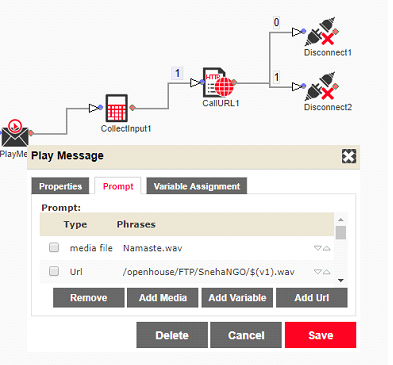
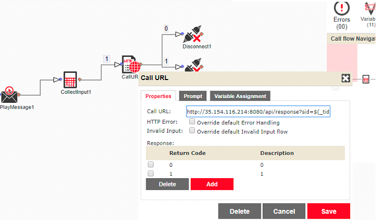

ImiMobile - Setup a new call flow
===================


Please follow the below steps for setting up new callflow using the ImiMobile workflow designer.

> - Go to http://openhouse.imimobile.com
> - Click on Login and enter your credentials. Create a new account if you haven't created one.
> - Click on top right corner on your user name, and then click on My Account
> - Go to "I want to manage my Assets" -> Call Flow Designer
> - Here you can create a new call flow from scratch.

----------


Call flow Components
-------------

The below images shows a sample call flow where a personalized message is played for the call recipient and the responses are captured.





#### **Play Message Component:**

> - Play message component will play the dynamic and the constant message of the call. 
> - Constant components needs to be uploaded on the the call flow page while the dynamic components file name will be passed within the requests. 
> - Each call flow expects 6 variable file names(v1 to v6 used as x-imi-ivrs-v1:<FileName>;x-imi-ivrs-v2:<FileName>). These files will generally will point to following audio
v1 : GuardianNane
v2 : ChildName
v3 : VaccineName
v4 : VaccineDay
v5 : VaccineMonth
v6 : VaccineYear

#### **Collector Input Component:**

> - This component will wait for user input and accordingly will pass into next step.


#### **Call URL Component:**

> - This component will trigger an Http get call to service hosted on our end. Details for this endpoint needs to be configured within the callflow. 
> - Endpoint details will not be passed as part of the request.
Currently for the sample callflow the following  url - http://hostIP:port/api/response?sid=\$(_tid)&MobileNo=\$(_dnis)&DTMF=\$(_dtmf)
Here each variable will specifies some details.
\$(_tid) : transactionId or the UUID which we will receive when we call the imi service.
\$(_dnis) : mobile number
\$(_dtmf) : user input

Response format
-------------
> From the ImiMobile provider side we get 2 different types of responses. Both the responses serve different purposes - one is to log the time taken and other is to log the user input.

> -	Reponse which will be received as part of each call made. The url to this endpoint is passed as part of the request made to imimobile(within code this is set using property app.imimobile.callbackurl).This response will contains various attributes about the call made. From Imi side a  post call is made to a service endpoint on our side. We currently extract Uuid and callduration.
Sample message
```
	<response>
           <evt-notification>
               <evt-info>
                   <tid>1528622669_9080415958</tid>
                   <offered-on>2018-06-10 14:54:30.395</offered-on>
                   <accepted-on>2018-06-10 14:54:34.200</accepted-on>
                   <answered-on>2018-06-10 14:54:37.016</answered-on>
                   <released-on>2018-06-10 14:55:08.797</released-on>
                   <drop-type>100</drop-type>
                   <drop-reason>INVALID Content-Type OR HTTP TIMEOUT.</drop-reason>
                   <drop-description>App_initiated_reject</drop-description>
                   <call-duration>32</call-duration>
                   <total-pulses>2</total-pulses>
                   <callresult></callresult>
                   <externalParams>
                       <_esb_trans_id>urn:uuid:db90656e-0060-412a-81f8-de26dc5e4a55</_esb_trans_id>
                       <_errorcode>2006</_errorcode>
                       <_dtmf>2</_dtmf>
                   </externalParams>
                </evt-info>
            </evt-notification>
     </response>
```

